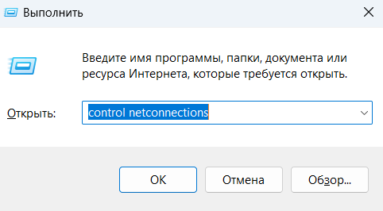
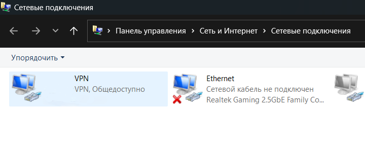
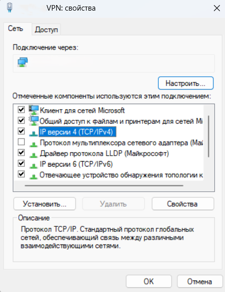
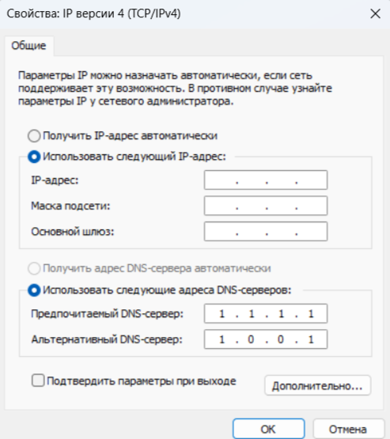
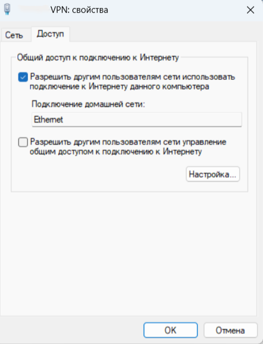
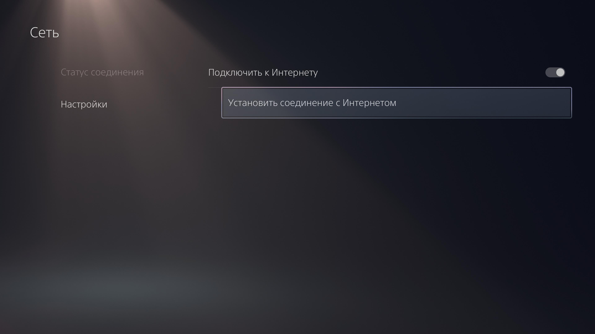
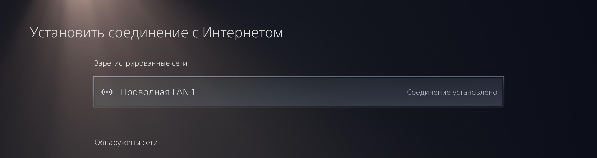
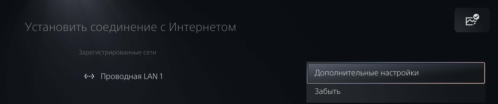
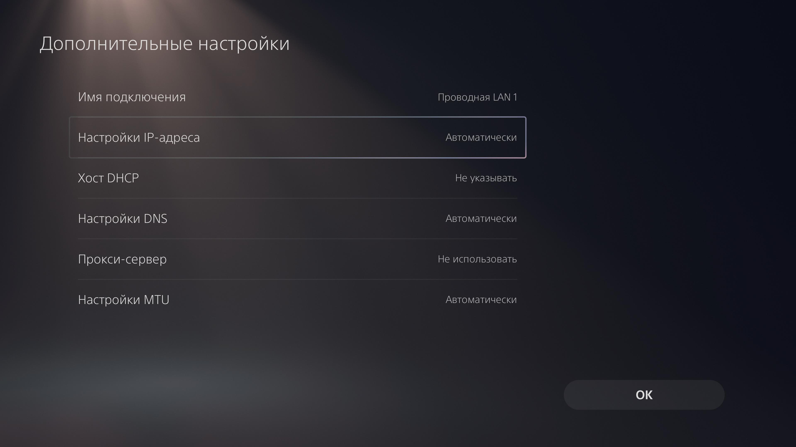
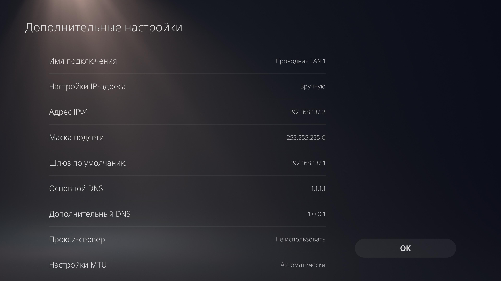

# Настройка VPN на PlayStation через компьютер

Эта инструкция поможет вам настроить VPN для использования на вашей PlayStation через компьютер.

## Шаги настройки

1. **Открыть "Сетевые подключения":**
   - Нажмите одновременно клавиши **Win + R** на клавиатуре.
   - В открывшемся окне введите следующую команду и нажмите **Enter**:
   
     ```
     control netconnections
     ```

   

3. **Найти подключение VPN:**
   - Откроется окно **Сетевые подключения**. Найдите ваше подключение VPN.
   
   

4. **Открыть свойства подключения:**
   - Щелкните правой кнопкой мыши на вашем подключении VPN и выберите **Свойства**.

5. **Настройка DNS:**
   - В окне свойств выберите **Протокол Интернета версии 4 (TCP/IPv4)** и нажмите **Свойства**.
   
   

   - В разделе **Использовать следующие адреса DNS-серверов** введите предпочитаемые DNS-серверы:
     - 1.1.1.1 и 1.0.0.1
   - Нажмите **ОК**, чтобы сохранить настройки.
     
   

7. **Настройка общего доступа:**
   - Вернитесь в окно свойств вашего VPN-подключения и перейдите на вкладку **Сетевой доступ**.
   - Установите флажок **Разрешить другим пользователям сети использовать подключение к Интернету этого компьютера**.
   - Выберите ваше Ethernet соединение из списка.
   - Нажмите **ОК**, чтобы сохранить изменения.
     
   

8. **Настройка PlayStation:**
   - Подключите вашу PlayStation к тому же сетевому соединению, что и компьютер, и настройте её следующим образом:

9. Перейдите в **Настройки** -> **Сеть** -> **Настройки** -> **Установить соединение**.

   

10. Выберите **LAN-сеть**.
   
    

11. Нажмите **Option** на джойстике, откроется меню, выберите **Дополнительные настройки**.

    

12. Перейдите до меню **Настройки IP-адреса** и измените с **Авто** на **Вручную**.

    

13. Введите те же настройки, что и на скриншоте ниже, и нажмите **ОК**.

    

Теперь ваша PlayStation должна использовать VPN-соединение через компьютер.

## Устранение проблем

Если соединения нет, попробуйте открыть PowerShell на компьютере от имени администратора и ввести следующие команды:

1. **Открытие PowerShell от имени администратора:**
   - Нажмите на кнопку **Пуск** или нажмите клавишу **Windows** на клавиатуре.
   - Введите **PowerShell** в строке поиска.
   - Щелкните правой кнопкой мыши на **Windows PowerShell** в списке результатов.
   - Выберите **Запуск от имени администратора**.
   - Если появится запрос контроля учетных записей, нажмите **Да**.

2. **Ввод команд:**
   - В открывшемся окне PowerShell введите следующие команды и нажмите **Enter** после каждой:

```powershell
route delete 192.168.137.0
```

```powershell
route add 192.168.137.0 mask 255.255.255.0 192.168.137.1
```
